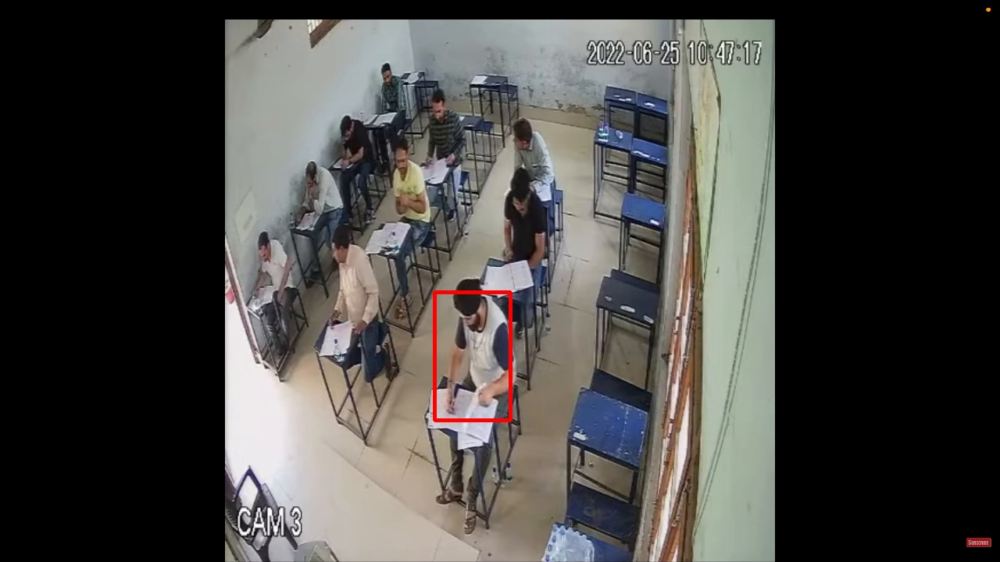
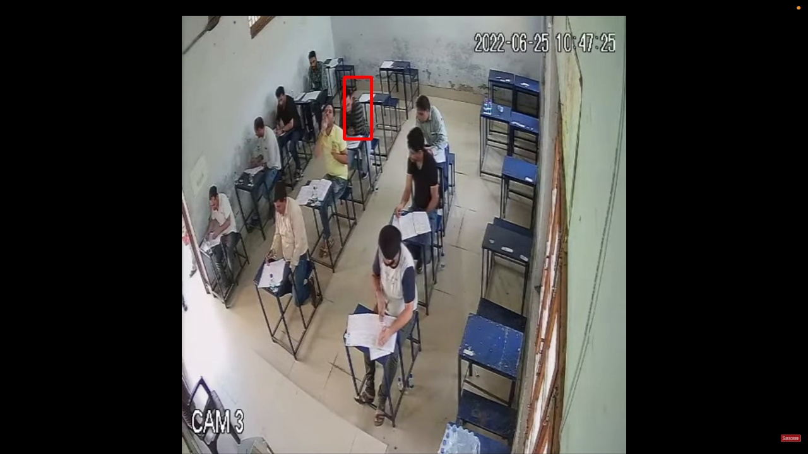
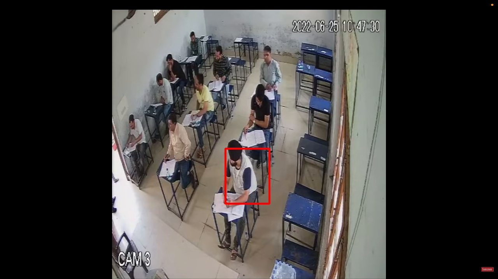
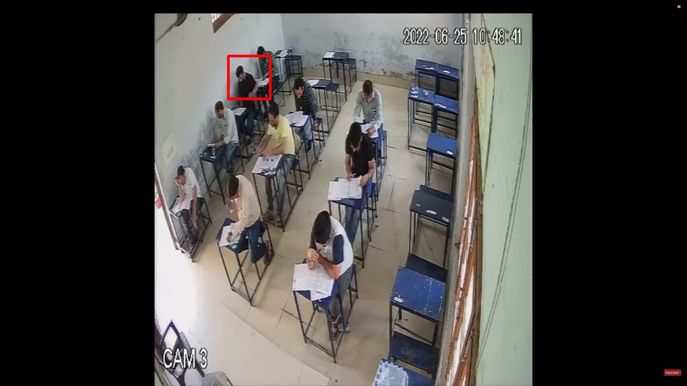
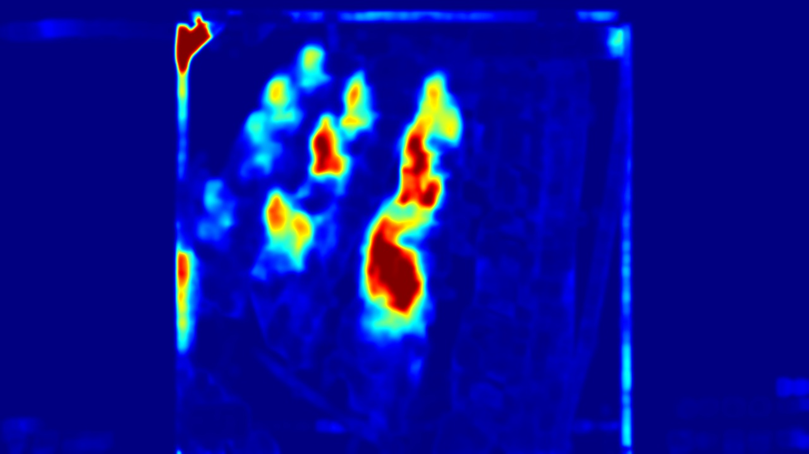
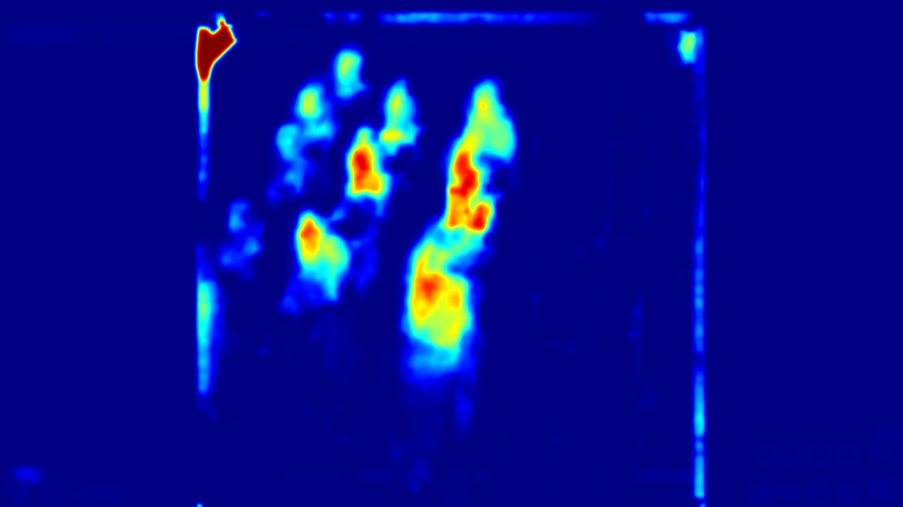
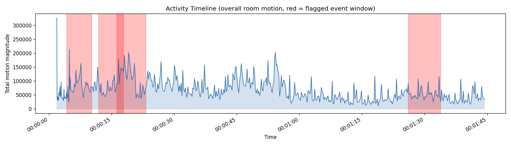

# DRISHTIAI PS2

**Offline Video Segmentation & ROI Detection using Motion Estimation**
Problem Statement 2 - Drishti AI Hackathon 2026
Team DI2_04 — The Fellowship of the Ring

The outputs below are real and are generated directly by the pipeline on a sample exam-hall CCTV camera recording.

---

## Flagged Events

When a zone's motion clears both the relative and absolute thresholds *and* sustains for several consecutive frames, an event is opened, clipped, and logged. Here are all 4 events flagged in this run:

| | | |
|---|---|---|
| **Event 1** — Zone 0 · z=2.77 · 00:00:04–00:00:10 | **Event 2** — Zone 10 · z=3.29 · 00:00:11–00:00:17 | **Event 3** — Zone 6 · z=9.06 · 00:00:16–00:00:23 |
|  |  |  |

| **Event 4** — Zone 7 · z=3.41 · 00:01:26–00:01:33 |
|---|
|  |

Each event is exported as its own clip, pre/post buffered so the invigilator sees context, not just a single frame:

- [`results/event_clips/event_0001_z0.mp4`](results/event_clips/event_0001_z0.mp4)
- [`results/event_clips/event_0002_z10.mp4`](results/event_clips/event_0002_z10.mp4)
- [`results/event_clips/event_0003_z6.mp4`](results/event_clips/event_0003_z6.mp4)
- [`results/event_clips/event_0004_z7.mp4`](results/event_clips/event_0004_z7.mp4)

---

## Motion Heatmaps

Percentile-clipped so no single outlier frame dominates the map - one shows *how strong* motion was, the other *how often* a spot was active across the whole session.

| Intensity | Presence |
|---|---|
|  |  |

---

## Activity Timeline

Total room motion over time, with flagged event windows shaded — gives an invigilator the whole session at a glance instead of scrubbing through raw footage.



---

## Structured Event Log

Every flagged event is written out as CSV/JSON — searchable, timestamped, zoned, and reason-tagged, ready to hand to an investigator instead of raw video:

| Zone | Window | Duration | Peak z-score | Flag Reason |
|---|---|---|---|---|
| 0 | 00:00:04–00:00:10 | 6.0s | 2.77 | sustained motion, tracked person 0 |
| 10 | 00:00:11–00:00:17 | 6.0s | 3.29 | sustained motion, tracked person 10 |
| 6 | 00:00:16–00:00:23 | 7.0s | 9.06 | sustained motion, tracked person 6 |
| 7 | 00:01:26–00:01:33 | 7.8s | 3.41 | sustained motion, tracked person 7 |

Full file: [`results/roi_events.csv`](results/roi_events.csv)

**Private-zone intrusion tracking** (does someone's motion cross into a neighbour's space) ran alongside the main pipeline and logged candidate boundary crossings independently: [`results/private_zone_intrusions.json`](results/private_zone_intrusions.json)

---

## Pipeline at a Glance

```
Video → Frame Sampling → Farneback Optical Flow → Per-Person Zoning
      → Two-Part Deviance Gate (relative z-score + absolute ceiling)
      → Ambient Movement Filter (ignores invigilator walking)
      → Blob Detection → Object Detection (phone/book, on active ROIs only)
      → Event Segmentation (hysteresis) → Clip Export
      → Heatmap + Timeline + Structured CSV/JSON Log
```

Runs entirely offline on CPU (OpenCV + optional YOLOv9 for object detection), with graceful fallback to fixed-grid zoning if person detection is unavailable — no GPU required.

---

## Output Folder Reference

```
output_ps2/
├── annotated_roi_run.mp4
├── roi_frames/              # annotated frames, ~1/sec + one peak frame per event
├── event_clips/              # one .mp4 per flagged event, pre/post buffered
├── heatmaps/
│   ├── motion_heatmap_intensity.jpg
│   └── motion_heatmap_presence.jpg
├── zone_heat_summary.json
├── activity_timeline.png
├── roi_events.csv / roi_events.json
└── private_zone_intrusions.json
```
